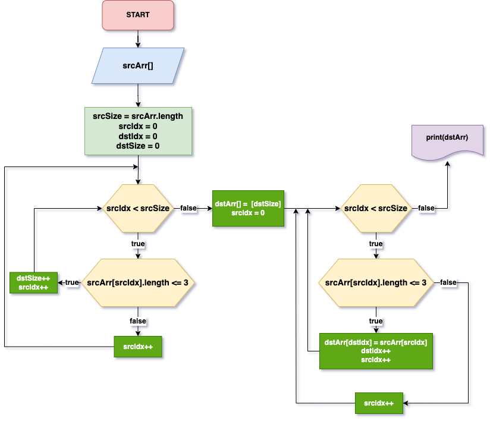

<!DOCTYPE html>
<html lang="ru">
  <head>
    <meta charset="UTF-8" />
    <meta name="viewport" content="width=device-width, initial-scale=1.0" />
    <title>Page Title</title>
    
  </head>
  <body>
    

     
DISCLAIMER

    Представленные решения не претендуют на эффективность или истинность и представлены с целью академического изучения и самоконтроля
    

  </body>
</html>

# Итоговая контрольная работа по основному блоку

Задача: Написать программу, которая из имеющегося массива строк формирует новый массив из строк, длина которых меньше, либо равна 3 символам. Первоначальный массив можно ввести с клавиатуры, либо задать на старте выполнения алгоритма. При решении не рекомендуется пользоваться коллекциями, лучше обойтись исключительно массивами.

## Блок-схема алгоритма решения:

## Описание решения

Данная задача решена в четырех вариантах и написана на трех языках программирования. Этапы выполнения задачи зафиксированы в системе контроля версий Git и синхронизированы с сервисом github.com:

* [Java](/java/ "Java"): задача решена с использованием элементов объектно-ориентированного и функционального программирования, некоторых порождающих паттернов проектирования. Вопросы потокобезопасности в решении не рассматриваются. В качестве основного обработчика предлагается singleton-класс с [рекурсивным методом](/java/src/main/java/ru/aberezhnoy/arrayService/impl/ArrayHandlerImpl.java "метод"):
  
  1. `Метод принимает исходный массив, поданный пользователем, и итератор, равный количеству элементов исходного массива`
  2. `Метод вызывает сам себя с декрементом итератора, проверяет условие отбора элементов массива, в случае совпадения инкрементирует переменную размера для инициализации выходного массива, инициализированную нулем при создании класса`
  3. `Условием выхода является полный проход исходного массива, то есть количеству вызовов метода, равным количеству элементов`
  4. `В условии выхода, метод простым циклом заполняет выходной массив элементами исходного массива, соответствующими условию задачи. В качестве итерируемого индекса для выходного массива используется переменная, заданная в параметрах цикла, но итерируемая постфиксной формой инкремента, только при выполнении условия`
  5. `Условия выхода из рекурсии и отбора элементов проверяются с помощью предикатов, инициализируемых при создании класса через конструктор`
  6. `Результатом работы метода является возврат выходного (искомого) массива строк`
  7. `В случае отсутствия совпадений по условию отбора строк выбрасывается исключение, во избежание последующего прохода массива и проверки условия задачи`

* [C#](/cs/ "C#"): решение упрощено, относительно предыдущего. Проверки не производятся, в качестве сервисного выступает класс с методами приглашения пользователя и печати массива в строковом виде в консоль. Предлагается два метода-обработчика, с двойным и одиночным вызовом цикла:

  1. `Метод принимает исходный массив, поданный пользователем`
  2. `Внутри метода, первый цикл проходит исходный массив и проверяет условие отбора элементов массива, в случае совпадения инкрементирует переменную размера для инициализации выходного массива`
  3. `Инициализируется выходной массив`
  4. `Вторым циклом заполняется выходной массив элементами исходного массива, соответствующими условию задачи. В качестве итерируемого индекса для выходного массива используется переменная, заданная в параметрах цикла, но итерируемая постфиксной формой инкремента, только при выполнении условия`
  5. `В методе с одним циклом реализована та же логика, с разницей лишь в увеличении длины прохода в два раза плюс один (для разовой, не зацикленной инициализации массива) и работе с операторами ветвления`

* [Python](/python/main.py "Python"): простейшее решение в процедурном стиле, представлено для иллюстрации работы с коллекциями.

* <a href=https://youtu.be/UEo5Qrn3Zo0?feature>YouTube</a>: записан небольшой гайд по возможному решению данной задачи с помощью командной строки

### Работу выполнил студент группы 4869
Александр Бережной 